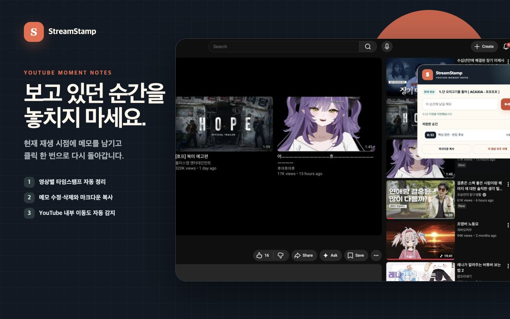
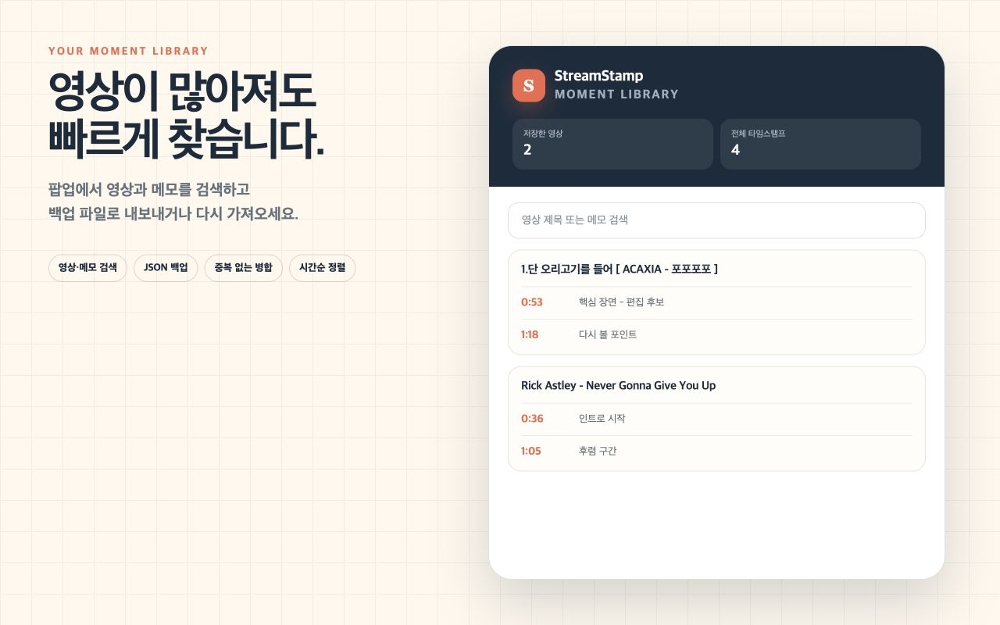

# StreamStamp

YouTube 영상의 중요한 순간을 타임스탬프와 메모로 기록하는 로컬 Chrome 확장 프로그램입니다.

[Chrome Web Store에서 설치](https://chromewebstore.google.com/detail/streamstamp-youtube-times/gjmomonbilmjemihbipjcohhadnobblp) · [최신 GitHub Release](https://github.com/ThankyouJerry/streamstamp/releases/latest)

> Chrome Web Store에는 현재 `1.0.0`이 배포되어 있습니다. 이 저장소의 `1.1.0`은 다음
> 스토어 업데이트를 위한 개선 버전입니다.

## 화면





## 주요 기능

- 현재 재생 위치를 메모와 함께 저장
- 저장한 시점으로 즉시 이동
- 메모 수정, 개별 삭제 및 영상별 전체 삭제
- 영상 제목과 메모 통합 검색
- 영상별 타임스탬프를 마크다운으로 복사
- 전체 기록을 JSON으로 백업하고 기존 데이터에 병합 복원
- 플로팅 버튼과 패널 위치를 Chrome 로컬 저장소에 보관
- YouTube 홈에서 영상으로 이동하는 SPA 탐색 대응

## 개인정보

타임스탬프, 메모와 UI 설정은 `chrome.storage.local`에만 저장됩니다. StreamStamp에는
분석 도구, 광고 SDK 또는 외부 데이터 서버가 없습니다.

자세한 내용은 [개인정보 처리방침](extension/PRIVACY_POLICY.md)을 확인해 주세요.

## 설치

일반 사용자는 [Chrome Web Store](https://chromewebstore.google.com/detail/streamstamp-youtube-times/gjmomonbilmjemihbipjcohhadnobblp)에서 설치할 수 있습니다.

개발 버전은 다음 순서로 설치합니다.

1. `npm run build:extension`을 실행합니다.
2. Chrome에서 `chrome://extensions`를 엽니다.
3. `개발자 모드`를 켭니다.
4. `압축해제된 확장 프로그램을 로드합니다`를 누릅니다.
5. `dist/StreamStamp-v{version}/` 폴더를 선택합니다.

## 개발 및 검증

```bash
npm run test:extension
npm run build:extension
```

배포 결과는 `dist/`에 생성됩니다.

```text
dist/
├── StreamStamp-v{version}/
├── StreamStamp-v{version}.zip
└── SHA256SUMS.txt
```

확장 프로그램 코드는 `extension/`에 있습니다. 저장소 루트의 Next.js/Supabase 앱은 여러
기기 동기화를 검토하기 위한 웹 프로토타입이며 현재 일반 사용자용 서비스가 아닙니다.

## 권한

| 권한 | 이유 |
| --- | --- |
| `storage` | 타임스탬프, 메모와 UI 위치를 브라우저에 저장합니다. |
| `activeTab` | 사용자가 팝업을 열었을 때 현재 탭이 YouTube 영상인지 확인합니다. |
| `youtube.com` 콘텐츠 스크립트 | YouTube 영상 페이지에 기록 패널을 표시합니다. |

## 라이선스

[MIT License](LICENSE)

StreamStamp는 YouTube 또는 Google의 공식 제품이 아닌 독립 오픈소스 프로젝트입니다.
